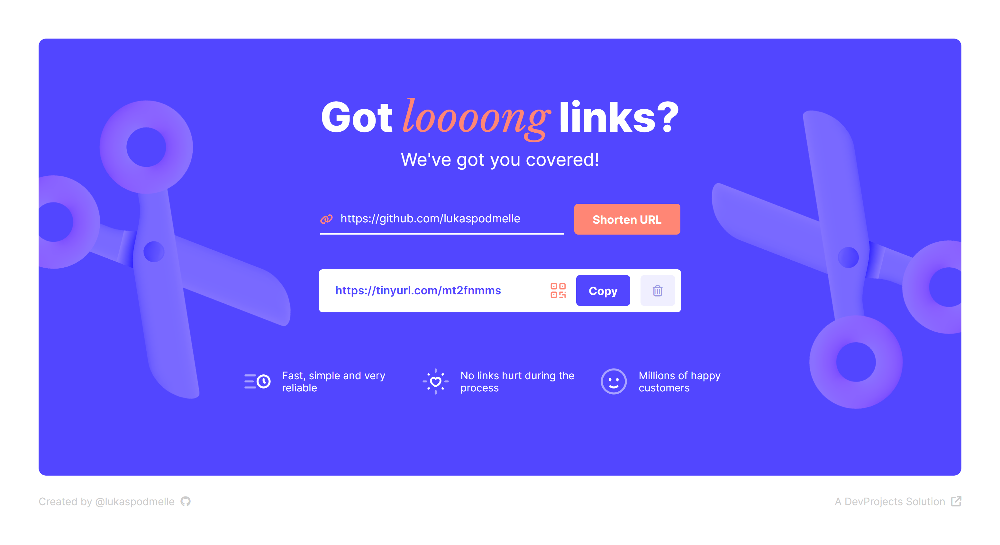

# Link Shortener
This project is a solution to a challenge from [DevProjects](https://www.codementor.io/projects). More details can be found [here](https://www.codementor.io/projects/web/link-shortener-website-brqjanf6zq).

**Built with HTML, CSS and JavaScript.**

### :point_right: [**Live Preview**](https://got-long-links.netlify.app/) 

Feedback is welcome!

# Resources
* [TinyURL](https://tinyurl.com/) API for shortening links
* [GoQR](https://goqr.me/api/doc/create-qr-code/) for creating QR codes
